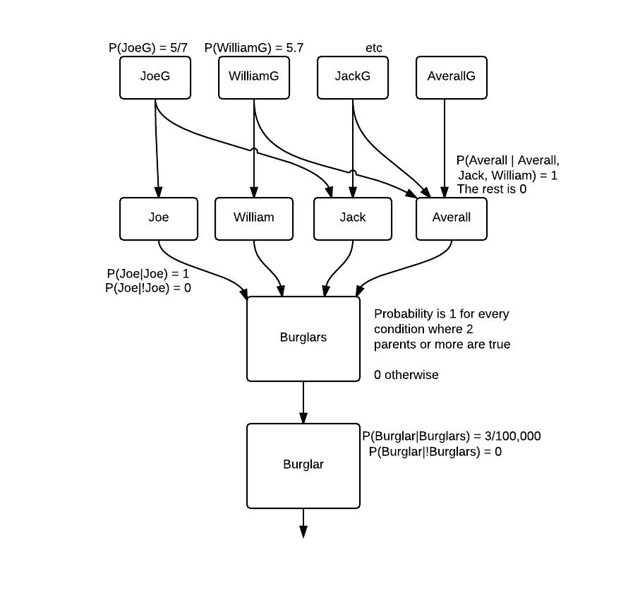

#Practical Assignments (Series 2) Report BKI312 (2014-2015)
----
*Michel Meijerman and Guido Zuidhof* (s0723630 & s4160703) **Kunstmatige Intelligentie**
January 2015

----
##Assignment 2-1: Probalistic representation and reasoning (and burglars)

1 . See image below.

2 . We do not know the probabilities of the alarm going off given both earthquake and burglar, so we decided to add intermediate nodes and a noisy OR function for the alarm node.


3 . We added the corresponding conditional probability tables in the same image, next to the nodes of the Bayesian network.

4 .
Specifying the probabilities of `Earthquake` and `Burglar` was relatively straightforward.
The length of a year is pretty arbitrary, we opted to include an additional `.25` to account for leap years. We didn't care about leap seconds.
```
prob earthquake: 1/(365.25*10).
prob burglar: 1/(365.25*10).
```

For the other nodes we had to capture the probabilities given their parents. To do this we introduced an extra assumable for every combination of assignment parent nodes.
Here is what that looks like:
```
gibbons <- alarm & gibbonsWhenAlarm.
prob gibbonsWhenAlarm: 0.99.
gibbons <- ~alarm & gibbonsWhenNoAlarm.
prob gibbonsWhenNoAlarm: 0.04.

```

For the intermediate nodes we could have used a single probability for 3 out of 4 possible combinations (because OR is true in 3 out of 4 cases with 2 inputs), however, we chose to explicitly name all three.
This helped us in reasoning about the computed probability.

```
% Implementation of the alarm node
% P(Alarm | Intermediate1, Intermediate2)
alarm <- i1 & i2 & both.
prob both: 1.
alarm <- i1 & ~i2 & only1.
prob only1: 1.
alarm <- ~i1 & i2 & only2.
prob only2: 1.
alarm <- ~i1 & ~i2 & neither.
prob neither: 0.
```

See `alarmold.ail` for the full file

5 .
**a** The prior probability of a burglar
```
ailog: predict burglar.
Answer: P(burglar|Obs)=0.0002737850787132101.
```
**b** The probability of a burglar given that Watson called.
```
ailog: observe watson.
Answer: P(watson|Obs)=[0.4001259354393795,0.4001260553726104].
ailog: predict burglar.
Answer: P(burglar|Obs)=[0.0005336834855891426,0.0005340131980691032].
```
**c** The probability of a burglary given that Gibson also reports it.
```
ailog: observe gibbons.
Answer: P(gibbons|Obs)=[0.040597992893187634,0.04060035483349863].
ailog: predict burglar.
Answer: P(burglar|Obs)=[0.012679674914803903,0.012762846117401184].
```
**d**  The probability of a burglary given that the newscast reported an earthquake.

```
ailog: prob_threshold 0.0000000001.
%
% All previous commands.
%
ailog: observe radio.
Answer: P(radio|Obs)=0.003087006752473501.
ailog: predict burglar.
Answer: P(burglar|Obs)=0.001959476787703731.
```
This probability only becomes smaller upon observing the news broadcasting an earthquake. The odds of a burglar given that Gibson and Watson report an alarm were already very small.

When the odds of an earthquake go up (because observing the radio broadcasting this news makes it more likely there was an earthquake) increase the chance of the alarm being caused by an earthquake, decreasing the chance of a burglary given that Watson and Gibson reported an alarm. Hence this chance is smaller than the previous query.

**e** The most probable explanation for the observed evidence.

```
load 'alarmold.ail'. prob_threshold 0.00000000001. observe watson. ok. observe gibbons. ok. observe radio. ok.

ailog: predict burglar.
Answer: P(burglar|Obs)=0.001959476787703731.
  [ok,more,explanations,worlds,help]: worlds.
  0: [burglar,earthquake,gibbonsWhenNoAlarm,radioWhenEarthquake,watsonWhenNoAlarm,~intermediate1WhenEQ,~intermediate2WhenBurglar]  Prob=4.796369771016547e-11
  1: [burglar,gibbonsWhenNoAlarm,radioWhenNoEarthquake,watsonWhenNoAlarm,~earthquake,~intermediate2WhenBurglar]  Prob=4.37936192710215e-11
  2: [burglar,earthquake,gibbonsWhenAlarm,intermediate2WhenBurglar,only2,radioWhenEarthquake,watsonWhenAlarm,~intermediate1WhenEQ]  Prob=4.510985769641058e-8
  3: [burglar,gibbonsWhenAlarm,intermediate2WhenBurglar,only2,radioWhenNoEarthquake,watsonWhenAlarm,~earthquake]  Prob=4.1187898924395694e-8
  4: [burglar,earthquake,gibbonsWhenAlarm,intermediate1WhenEQ,only1,radioWhenEarthquake,watsonWhenAlarm,~intermediate2WhenBurglar]  Prob=5.935507591632977e-10
  5: [both,burglar,earthquake,gibbonsWhenAlarm,intermediate1WhenEQ,intermediate2WhenBurglar,radioWhenEarthquake,watsonWhenAlarm]  Prob=1.1277464424102645e-8
```
The most likely situation where burglar is in your house given the observations is the one with the highest probability.

In this case, following from the output, it's

`world 0: [[burglar,earthquake,gibbonsWhenNoAlarm,`
`radioWhenEarthquake,watsonWhenNoAlarm,~intermediate1WhenEQ,~intermediate2WhenBurglar]`

### Calculation by variable elimination

#### Initial (relevant) factors

```
f1 (Earthquake) =
(Earthquake) 0.02738
(¬Earthquake) 0.97262

f2 (Burglar) =
(Burglar) 0.02738
(¬Burglar) 0.97262

f3 (I1, Earthquake) =  
(I1, Earthquake) 0.2
(I1, ¬Earthquake) 0.0
(¬I1, Earthquake) 0.8
(¬I1, ¬Earthquake) 1.0

f4 (I2, Burglar) =
(I2, Burglar) 0.95
(I2, Burglar) 0.0
(¬I2, ¬Burglar) 0.05
(¬I2, ¬Burglar) 1.0

f5 (Alarm, I1, I2) =
(Alarm, I1, I2) 1.0
(Alarm, I1, ¬I2) 1.0
(Alarm, ¬I1, I2) 1.0
(Alarm, ¬I1, ¬I2) 0.0
(¬Alarm, I1, I2) 0.0
(¬Alarm, I1, ¬I2) 0.0
(¬Alarm, ¬I1, I2) 0.0
(¬Alarm, ¬I1, ¬I2) 1.0

```

Elimination order:
`Earthquake, Burglar, I1, I2, Alarm `


Eliminate `Earthquake`:
```
f6 = f1 (Earthquake) * f3 (I1, Earthquake)  

f6 (I1) =
[I1 T] 0.00548
[I1 F] 0.99452
```

Eliminate `Burglar`
```
f7 = f2 (Burglar) * f4 (I2, Burglar)

f7 (I2) =
[I2 T] 0.02601
[I2 F] 0.97399
```

Eliminate `I1`
```
f8 = f5 (Alarm, I1, I2) * f6 (I1)

f8 (Alarm, I2) =
[Alarm T, I2 T] 1.0
[Alarm T, I2 F] 0.00548
[Alarm F, I2 T] 0.0
[Alarm F, I2 F] 0.99452
```

Eliminate `I2`
```
f9 = f7 (I2) * f8 (Alarm, I2)

f9 (Alarm) =
[Alarm T] 0.03134
[Alarm F] 0.96866
```
**Conclusion:** `p(Alarm) = 0.03134`

Let's compare this to the *AILog*'s answer:
```
ailog: load 'alarmold.ail'.
AILog theory alarmold.ail loaded.
ailog: predict alarm.
Answer: P(alarm|Obs)=[0.0003148385984490197,0.0003148985650644805].
```
Oops, this differs quite a lot. It seems that we started with the wrong values for `P(burglar)` and `P(earthquake)`.
Our values were 100 times as high, resulting in around 100 times as high odds.

Here is the resulting calculation with the right values for `burglar` and `earthquake`, in a shorter form:
`(1/(365.25*10)) * 0.2 + (1/(365.25*10))*0.95 * (1 - (1/(365.25*10))*0.2)`
`= 0.000314838598449019709808430088061911782549808598744167895279...`

That's better, this matches AILog's calculations! I expected a difference due to the arbitrary precision in the last calculation, but it seems the floating point errors in *AILog* are quite small.

### Comparison to AILog's approach

An AILog program contains facts and constraints in first order logic. Hypotheses are represented as a set of assumables. The logic formula are converted to horn clauses and then SLD resolution is used to derive the goal clauses.
Variable elimination involves "removing" nodes one by one, until only the question node remains.
This has upsides downsides as it introduces a form of bookkeeping (factors). These factors are used to prevent dual calculations, which can occur in *AILog*'s approach. This is a form of dynamic programming (keeping track of what you have calculated).
Because of this bookkeeping additional memory is required for the computation, and the order in which the variables are eliminated can influence the amount of operations necessary. So, finding a (sub-)optimal order may take even more computation than it saves!
Another downside is that variable elimination is a method for computing probablities in a bayesian network, and not for more general 'queries'.
The upside is that less computations are required with a reasonable order.

So there are situations in which variable elimination is preferable, and situations in which *AILog*'s approach is favorable.
The situations in which variable elimination is a good idea are those in which the problem is already defined in a bayesian network for which the order of elimination is easy to determine.
*AILog*'s approach is much more general, and probably the right choice for all other situations.


7 . Modeling this proved to be quite challenging. We started off by defining a bunch of predicates like one would do in prolog.
These predicates used the `needs/2` facts directly, so that we didn't have to "hardcode" this information.

A small snippet from this approach, the full attempt can be found in `alarmbk.ail`

```
% All required burglars go for burglar X
hasBuddies(Burglar, Going) <-
  needs(Burglar, Required) &
  allGoing(Required, Going)
.

% All burglars in list are going
% defined inductively.
allGoing([], Going).
allGoing([X|XS], Going) <-
  member(X, Going) &
  allGoing(XS)
.
```
We quickly found out that ailog isn't merely a superset of prolog. Although the code we defined may have been correct, the ailog REPL couldn't answer simple queries about it.

So we changed our approach, and instead we used the structure we used to define the bayesian network in the previous questions.
The full implementation can be found in `alarm.ail`. Here we discuss how every part of the problem domain is captured.

#### Burglars go, on average, 5 days out of 7

Note that the `G` after every name stands for `going`.
```
prob joeG:5/7.
prob williamG:5/7.
prob jackG:5/7.
prob averallG:5/7.
```


#### Burglars need their buddies
The burglars in the story have buddies, without whom they won't join the burglary.

```
joe <- joeG.
william <- williamG.
jack <- jackG & joe.
averall <- averallG & jack & william.

```

Obviously to go, every burglar needs himself to go, hence every node (if one sees this as a bayesian network) has their respective `nameG` variable as parent.
Aside from that, burglars `jack` and `averall` need some buddies, hence they also have as parents the nodes which capture whether their buddies are going.

#### They will only go out stealing if 2 or more are going
To capture this with our bayesian network approach, we enumerated all possible combinations of burglars going. It's similar to a noisy OR, but with a necessity of 2 truthy parents instead of 1.
For each, we determined specified whether enough were going.

```
% P(Burglars are going to any house)
burglars <- notEnoughBurglars & ~joe & ~william & ~jack & ~averall.
burglars <- notEnoughBurglars & ~joe & ~william & ~jack &  averall.
burglars <- notEnoughBurglars & ~joe & ~william &  jack & ~averall.
burglars <- enoughBurglars    & ~joe & ~william &  jack &  averall.
burglars <- notEnoughBurglars & ~joe &  william & ~jack & ~averall.
burglars <- enoughBurglars    & ~joe &  william & ~jack &  averall.
.
. % and all other combinations
.

prob enoughBurglars: 1.
prob notEnoughBurglars: 0.
```

#### They enter 3 out of 100,000 houses if they go

```
%P(Burglars hit my house)
burglar <- burglars & myHouse.

prob myHouse: 3/10000.
```

8. Yes, you could represent this in a Bayesian network. In fact, I believe I did so in the previous question.

We could describe what it looks like, but I think an illustration would work better.



This network represents the knowledge. An advantage to this approach is that it is easy to see the dependencies and how it influences the probabilities 'down the chain'.
A disadvantage is the rigidness (hardcoded-ness). Adding another burglar would involve making changes in multiple places.

##Assignment 2-2: Visual representations and reasoning

### Domain description

We chose to model the domain of football club logos. More specific: "commercial" football clubs (so not the Dutch soccer team, but Ajax for instance).
These logos have some interesting features that you see in many other logos as well.

Here are two examples:
<center>
   
</center>

These are the logos of *Club Atlético de Madrid* and *FC Barcelona*.
As you can see, they share some features. They are both shaped like a shield (as in *wapenschild*) and both have stripes embedded in the logo.

Both clubs are Spanish, could it be that Spanish football clubs logos often share features?

The goal is to represent these features in such a way that we can observe certain features of the logo, and ask what the most likely country is.

### Modelled data
The dataset we used was the [top 50 UEFA ranked footbal clubs list](http://www.uefa.com/memberassociations/uefarankings/club/).

#### Logo features

* **Circle:** The overall shape of the logo is circular.
* **Shield:** The logo contain a shield (*wapenschild*) shape.
* **Cross:** The logo contains a (christian) cross shape.
* **Star:** The logo contains one or more star shapes.
* **Letter:** The logo has letters, or numbers on it.
* **Animal:** The logo has some creature on it (animal, dragon, anything)
* **Stripe:** The logo features a stripe pattern.

#### Country
For every club logo, we also modeled the football club's country.

## Representation  in AILog

### Logo features

```
prob circle: 0.10.
prob shield: 0.10.
prob cross: 0.10.
prob star: 0.10.
prob letter: 0.10.
prob animal: 0.10.
prob stripe: 0.10.
```
Here some modelling decisions had to be made. What is the likelihood of a circle without observing it?
We decided to use 10% for every feature, so an assumption is made that all of these features are 'missed' as often as others, and are as defining as others.


#### Logo feature observations
We thought modeling the features of the logos would be pretty straightforward, in the pattern:

```
club <- observation1 of logo.
club <- observation2 of logo.
```

An example, the logo of *Steaua*:


Representation in *AILog*:
```
steaua <- shield.
steaua <- star.
steaua <- stripe.
steaua <- letter.
```
This was however the wrong approach, as a feature consists of all of these features, and the absence of other features.
It is more of a *constraint-based*/*constraint-satisfaction* problem.

Here is what we settled for, we define the constraints per logo.
```
steaua <- ~circle & shield & ~cross & star & letter & ~animal & stripe.
```


#### Country

For every country, we represented clubs in it as such:

```
esp <- realmadrid ; barcelona ; atleticomadrid ; valencia ; athletic ; villareal ; malaga.
ger <- bayernmunchen ; schalke ; dortmund ; leverkusen ; hannover.
eng <- chelsea ; arsenal; united; manchestercity; tottenham; liverpool.
... (13 more countries)
```
Unfortunately, AILog does not support the `;` operator for *or* constructs, so a clause had to be made for every club as such:

```
esp <- realmadrid.
esp <- barcelona.
esp <- atleticomadrid.
esp <- valencia.
esp <- athletic.
esp <- villareal.
esp <- malaga.
ger <- bayernmunchen.
...
```

#### Representativity bias
Some countries, such as Spain, represent a much larger slice of the top 50 football clubs.
So we (likely) have a more representative part of the Spanish top football clubs.

We felt we had to capture this into our model, we did it as such:

For every country, we determined the size of the national top tier football league (*eredivisie* equivalent). Let's call this `size`.
Then, we counted the amount of those clubs in the top 50, let's call this `count`.

We encoded the representativeness bias as `size/count`. Resulting probabilities:
```
prob espC : 7/20.
prob gerC : 5/18.
prob engC : 6/20.
prob porC : 4/18.
prob fraC : 3/20.
...
```

Then, we created clauses for querying which takes this representative-ness into account:
```
%Country polling variables
isesp <- espC & esp.
isger <- gerC & ger.
iseng <- engC & eng.
ispor <- porC & por.
isfra <- fraC & fra.
...
```

Finally, one clause was created for easier querying of 'any' country.
This is useful for checking which country is the most likely.
```
any <- isesp.
any <- isger.
any <- iseng.
any <- ispor.
...
```

### Style of reasoning

The main style of reasoning here is deductive reasoning because we felt it was more suitable for this domain.
We are reasoning from cause to 'effect'.
It seems more useful to observe a logo of a football club and extract some features of the logo.
Then we can use these features to reason about which club or what country etc. the club belongs to than the other way around.

Although, the model can be used in either direction.

### Queries and results

#### If I know nothing about the logo, what are the odds it's Spanish or French?
```
ailog: predict isfra.
Answer: P(isfra|Obs)=0.001869885.
```

```
ailog: predict isesp.
Answer: P(isesp|Obs)=0.020973330000000002.
```

The bias is clearly working here, as the probability of `isesp` are much higher. Things of course are much more interesting with observations!


#### How about if I see a cross?

```
ailog: observe cross.
Answer: P(cross|Obs)=0.1.
  [ok,more,explanations,worlds,help]: ok.
```
```
ailog: predict isfra.
No (more) answers.
```

```
ailog: predict isesp.
Answer: P(isesp|Obs)=0.00025515000000000005.
```
None of the French logos seem to have a cross in it!

#### How about if I do specifically not observe a cross?
```
ailog: observe ~cross.
Answer: P(~cross|Obs)=0.9.
  [ok,more,explanations,worlds,help]: ok.
```

```
ailog: predict isfra.
Answer: P(isfra|Obs)=0.00207765.
```

```
ailog: predict isesp.
Answer: P(isesp|Obs)=0.02327535.
```

Given this observation, it's quite ambiguous whether we are looking at a French or Spanish logo here!

#### More complex query

I am sure I see no cross or animal, but I do see letters and a shield.

```
ailog: observe ~cross. ok. observe ~animal. ok. observe letter. ok. observe shield. ok.
Answer: P(~cross|Obs)=0.9.
  [ok,more,explanations,worlds,help]: ailog: Answer: P(~animal|Obs)=0.9.
  [ok,more,explanations,worlds,help]: ailog: Answer: P(letter|Obs)=0.10000000000000002.
  [ok,more,explanations,worlds,help]: ailog: Answer: P(shield|Obs)=0.10000000000000002.
```

##### Which country is the likely?

```
ailog: predict any.
Answer: P(any|Obs)=0.3914937499999998.
  [ok,more,explanations,worlds,help]: worlds.
  0: [letter,rouC,shield,star,stripe,~animal,~circle,~cross]  Prob=4.05e-6
  1: [letter,shield,star,suiC,~animal,~circle,~cross,~stripe]  Prob=6.561000000000002e-5
  2: [engC,letter,shield,~animal,~circle,~cross,~star,~stripe]  Prob=0.00177147
  3: [greC,letter,shield,stripe,~animal,~circle,~cross,~espC,~star]  Prob=4.738500000000001e-5
  4: [letter,rusC,shield,star,~animal,~circle,~cross,~stripe,~suiC]  Prob=0.00011071687500000006
  5: [letter,porC,shield,~animal,~circle,~cross,~engC,~star,~stripe]  Prob=0.00091854
  6: [czeC,espC,letter,shield,stripe,~animal,~circle,~cross,~star]  Prob=1.43521875e-5
  7: [espC,letter,shield,stripe,~animal,~circle,~cross,~czeC,~star]  Prob=0.0002152828125
  8: [czeC,letter,shield,stripe,~animal,~circle,~cross,~espC,~greC,~star]  Prob=2.3692500000000004e-5
Answer: P(any|Obs)=0.3914937499999998.
```

This one is a bit hard to read, but you can see that world 2 is quite likely. This world contains `engC`, so it's most likely an English club.
Unfortunately, determining which club it is needs a manual lookup.. which is unfortunate.

##### Could it be a Dutch club?
```
ailog: predict isned.
No (more) answers.
```
Nope. This is because none of the Dutch clubs in the dataset satisfy the observed constraints.
There should however, still be a chance, as not all the Dutch clubs are modelled. Our model does not capture this, see reflection for a proposed solution.

#### Let's try some abductive querying.

I observe one of the Italian clubs in the list
```
ailog: observe ita.
Answer: P(ita|Obs)=0.06626610000000004.
```

What are the odds that there are letters in the logo?
```
ailog: predict letter.
Answer: P(letter|Obs)=0.9108910891089108.
```
Many Italian clubs have letters in their logo!


### Reflection
The model is fairly effective. Some big assumptions have been made about the feature likelihood though.

Areas where there is room for improvement:
* A country like Belgium has one club, if the a conflicting observation has been made with it's logo, the odds of `isbel` become 0. Which is not correct, as there may very well be a club in Belgium. A solution would be to somehow capture the likelihood of features per country, instead of using a dataset. Another solution would be a complete dataset.
* The representativeness bias may need to be adjusted. It currently has the effect that if one logo fits all possible constraints, it may still not be the club's country as not all clubs are modelled. I feel this is off.
* Like noted before, querying by most likely country is straightforward. The same can not be said for clubs unfortunately. A solution could be to add another 'constraint' per club-to-country clause that is the club's name, with a probability of 1. This would allow for easily reading which club logo it represents.
* There is no `XOR` in club logo's/countries. If all clubs would be modelled, the probabilities of all clubs may still not add up to 1 (no choice has to be made). So, if I observe 'France', the probability of other countries does not drop to 0.

Another "emergent behavior" of our model was this:

```
ailog: predict eng.
Answer: P(eng|Obs)=0.013194900000000006.
  [ok,more,explanations,worlds,help]: worlds.
  0: [animal,letter,shield,~circle,~cross,~star,~stripe]  Prob=0.0006561000000000002
  1: [animal,letter,~circle,~cross,~shield,~star,~stripe]  Prob=0.005904900000000003
  2: [animal,letter,shield,star,~circle,~cross,~stripe]  Prob=7.290000000000002e-5
  3: [letter,shield,~animal,~circle,~cross,~star,~stripe]  Prob=0.005904900000000003
  4: [animal,circle,letter,~cross,~shield,~star,~stripe]  Prob=0.0006561000000000002
```
Logo's with less features present are more likely to define the country. We are not certain this is desirable, it is caused by the logo feature probability of `0.10` "favoring" absent features.

------

Extending the model to a larger dataset, for more realistic real time operation is very straightforward. It involves simply adding more clubs by defining it's constraints, and updating the representativeness bias per country!
Also, more features could be added. Football club logos share many more features, for instance main color or the presence of a football in the logo.
