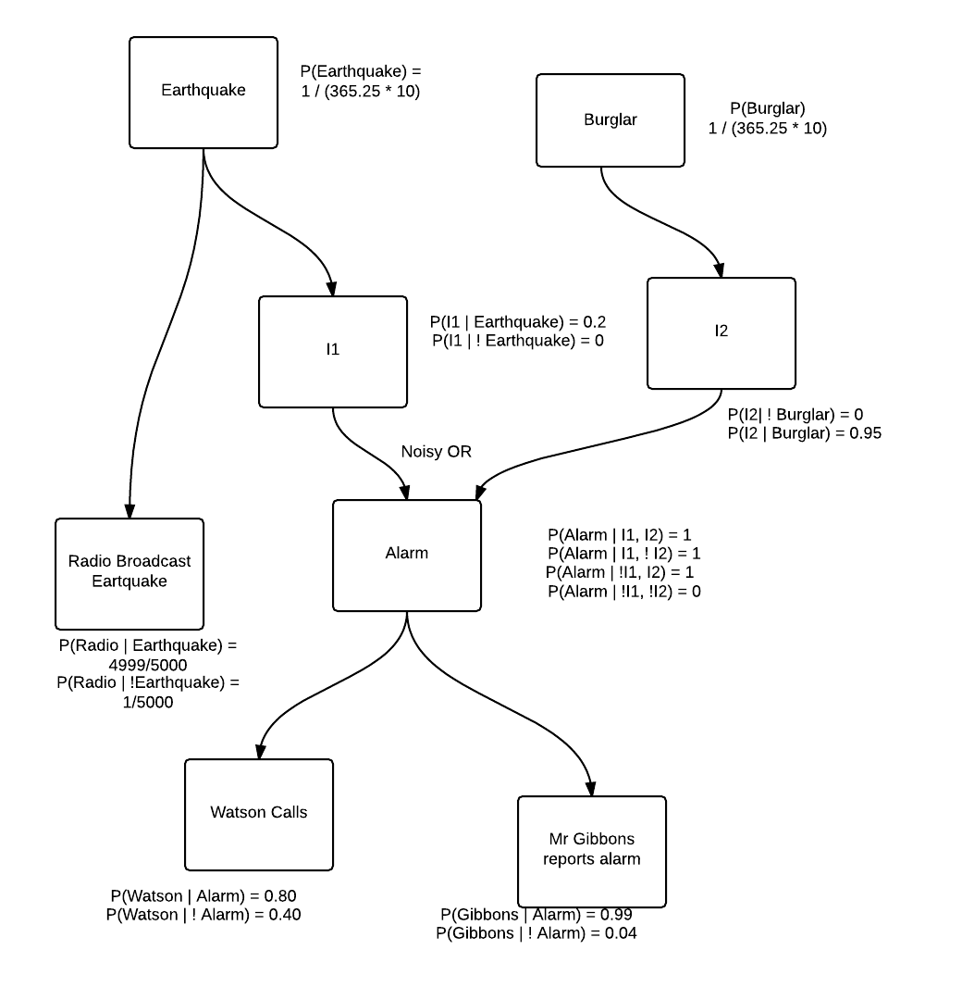

#Practical Assignments (Series 2) Report BKI312 (2014-2015)
----
*Michel Meijerman and Guido Zuidhof* (s0723630 & s4160703) **Kunstmatige Intelligentie**
January 2015

----
##Assignment 2-1: Probalistic representation and reasoning (and burglars)

1. Done.

2. We do not know the probabilities of the alarm going off given both earthquake and burglar, so we decided to add intermediate nodes and a noisy OR function for the alarm node.




3. We added the coresponding conditional probability tables in the same image, next to the nodes of the Bayesian network.

4. See `alarmbk.ail` for the full file.

Specifying the probabilities of `Earthquake` and `Burglar` was relatively straightforward.

```
prob earthquake: 1/(365.25*10).
prob burglar: 1/(365.25*10).
```

For the other nodes we had to capture the probabilities given their parents. To do this we introduced an extra assumable for every combination of assignment parent nodes.
Here is what that looks like:
```
gibbons <- alarm & gibbonsWhenAlarm.
prob gibbonsWhenAlarm: 0.99.
gibbons <- ~alarm & gibbonsWhenNoAlarm.
prob gibbonsWhenNoAlarm: 0.04.

```

For the intermediate nodes we could have used a single probability for 3 out of 4 possible combinations (because OR is true in 3 out of 4 cases with 2 inputs), however, we chose to explicitly name all three.
This helped us in reasoning about the computed probability.

```
% Implementation of the alarm node
% P(Alarm | Intermediate1, Intermediate2)
alarm <- i1 & i2 & both.
prob both: 1.
alarm <- i1 & ~i2 & only1.
prob only1: 1.
alarm <- ~i1 & i2 & only2.
prob only2: 1.
alarm <- ~i1 & ~i2 & neither.
prob neither: 0.
```


5.
**a** The prior probability of a burglar
```
ailog: predict burglar.
Answer: P(burglar|Obs)=0.0002737850787132101.
```
**b** The probability of a burglar given that Watson called.
```
ailog: observe watson.
Answer: P(watson|Obs)=[0.4001259354393795,0.4001260553726104].
ailog: predict burglar.
Answer: P(burglar|Obs)=[0.0005336834855891426,0.0005340131980691032].
```
**c** The probability of a burglary given that Gibson also reports it.
```
ailog: observe gibbons.
Answer: P(gibbons|Obs)=[0.040597992893187634,0.04060035483349863].
ailog: predict burglar.
Answer: P(burglar|Obs)=[0.012679674914803903,0.012762846117401184].
```
**d**  The probability of a burglary given that the newscast reported an earthquake.

```
ailog: observe radio.
Answer: P(radio|Obs)=[0.0030815093357329077,0.0031891013335391344].
ailog: prob_threshold 0.0000001.
ailog: predict burglar.
Answer: P(burglar|Obs)=[0.00022913576367648462,0.03396653904864052].
```
This probability only becames smaller upon observing the news broadcasting an earthquake. The odds of a burglar given that Gibson and Watson report an alarm were already very small.

When the odds of an earthquake go up (because observing the radio broadcasting this news makes it more likely there was an earthquake) increase the chance of the alarm being caused by an earthquake, decreasing the chance of a burglary given that Watson and Gibson reported an alarm. Hence this chance is smaller than the previous query.

**e** The most probable explanation for the observed evidence.

6. To do

7. Modeling this proved to be quite challenging. We started off by defining a bunch of predicates like one would do in prolog.
These predicates used the `needs/2` facts directly, so that we didn't have to "hardcode" this information.

A small snippet from this approach, the full attempt can be found in `alarmbk.ail`

```
% All required burglars go for burglar X
hasBuddies(Burglar, Going) <-
  needs(Burglar, Required) &
  allGoing(Required, Going)
.

% All burglars in list are going
% defined inductively.
allGoing([], Going).
allGoing([X|XS], Going) <-
  member(X, Going) &
  allGoing(XS)
.
```
We quickly found out that ailog isn't merely a superset of prolog. Although the code we defined may have been correct, the ailog REPL couldn't answer simple queries about it.

So we changed our approach, and instead we used the structure we used to define the bayesian network in the previous questions.
The full implementation can be found in `alarm.ail`. Here we discuss how every part of the problem domain is captured.

#### Burglars go, on average, 5 days out of 7

Note that the `G` after every name stands for `going`.
```
prob joeG:5/7.
prob williamG:5/7.
prob jackG:5/7.
prob averallG:5/7.
```


#### Burglars need their buddies
The burglars in the story have buddies, without whom they won't join the burglary.

```
joe <- joeG.
william <- williamG.
jack <- jackG & joe.
averall <- averallG & jack & william.

```

Obviously to go, every burglar needs himself to go, hence every node (if one sees this as a bayesian network) has their respective `nameG` variable as parent.
Aside from that, burglars `jack` and `averall` need some buddies, hence they also have as parents the nodes which capture whether their buddies are going.

#### They will only go out stealing if 2 or more are going
To capture this with our bayesian network approach, we enumerated all possible combinations of burglars going. It's similar to a noisy OR, but with a necessity of 2 truthy parents instead of 1.
For each, we determined specified whether enough were going.

```
% P(Burglars are going to any house)
burglars <- notEnoughBurglars & ~joe & ~william & ~jack & ~averall.
burglars <- notEnoughBurglars & ~joe & ~william & ~jack &  averall.
burglars <- notEnoughBurglars & ~joe & ~william &  jack & ~averall.
burglars <- enoughBurglars    & ~joe & ~william &  jack &  averall.
burglars <- notEnoughBurglars & ~joe &  william & ~jack & ~averall.
burglars <- enoughBurglars    & ~joe &  william & ~jack &  averall.
.
. % and all other combinations
.

prob enoughBurglars: 1.
prob notEnoughBurglars: 0.
```

#### They enter 3 out of 100,000 houses if they go

```
%P(Burglars hit my house)
burglar <- burglars & myHouse.

prob myHouse: 3/10000.
```

8. Yes, you could represent this in a Bayesian network. In fact, I believe I did so in the previous question.

We could describe what it looks like, but I think an illustration would work better.


This network represents the knowledge. An advantage to this approach is that it is easy to see the dependencies and how it influences the probabilities 'down the chain'.
A disadvantage is the rigidness (hardcoded-ness). Adding another burglar would involve making changes in multiple places.

##Assignment 2-2: Visual representations and reasoning

### Domain description

We chose to model the domain of football club logos. More specific: "commercial" football clubs (so not the Dutch soccer team, but Ajax for instance).
These logos have some interesting features that you see in many other logos as well.

Here are two examples:
<center>
 
</center>

These are the logos of *Club Atlético de Madrid* and *FC Barcelona*.
As you can see, they share some features. They are both shaped like a shield (as in *wapenschild*) and both have stripes embedded in the logo.

Both clubs are Spanish, could it be that Spanish football clubs logos often share features?

### Modelled data
The dataset we used was [top 50 UEFA ranked footbal clubs](http://www.uefa.com/memberassociations/uefarankings/club/).

#### Logo features

* **Circle:** The overall shape of the logo is circular.
* **Shield:** The logo contain a shield (*wapenschild*) shape.
* **Cross:** The logo contains a (christian) cross shape.
* **Star:** The logo contains one or more star shapes.
* **Letter:** The logo has letters, or numbers on it.
* **Animal:** The logo has some creature on it (animal, dragon, anything)
* **Stripe:** The logo features a stripe pattern.

#### Country
For every club logo, we also modelled the football club's country.

## Representation  in AILog

#### Logo features
Modelling the features of the logos was done pretty straightforward, in the pattern:

```
club <- observation1 of logo.
club <- observation2 of logo.
```

An example:


Representation in *AILog*:
```
steaua <- shield.
steaua <- star.
steaua <- stripe.
steaua <- letter.
```

#### Country

For every country, we represented clubs in it as such:

```
esp <- realmadrid ; barcelona ; atleticomadrid ; valencia ; athletic ; villareal ; malaga.
ger <- bayernmunchen ; schalke ; dortmund ; leverkusen ; hannover.
eng <- chelsea ; arsenal; united; manchestercity; tottenham; liverpool.
... (13 more countries)
```
